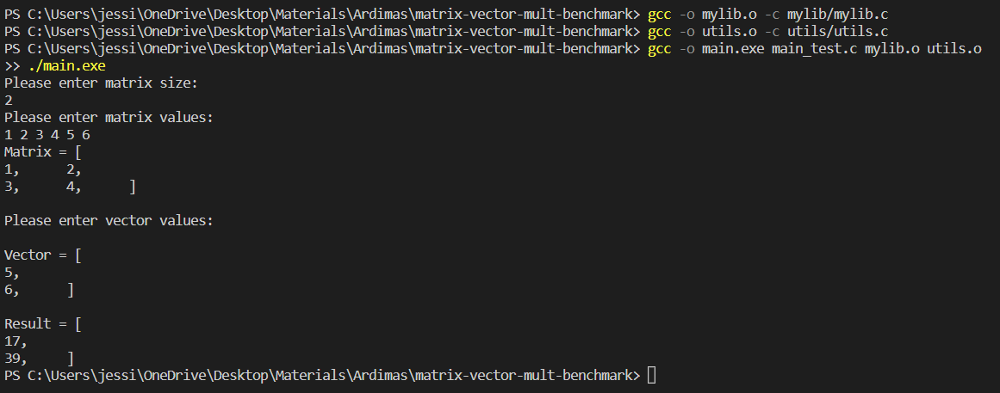
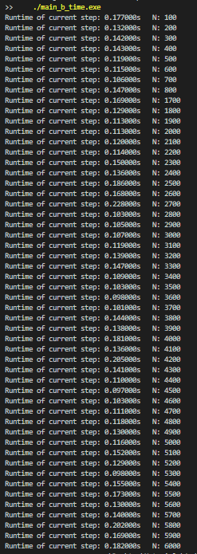

Git hub link: https://github.com/JessicaAngelah/matrix-vector-mult-benchmark.git

# Vector Matrix Multiplication Benchmark

This is a code to analyze vector matrix multiplication. The operating system used for this benchmarking is Windows OS.

## Running the Test

Steps to run the program:
```
gcc -o mylib.o -c mylib/mylib.c
gcc -o utils.o -c utils/utils.c
gcc -o main.exe main_test.c mylib.o utils.o
./main.exe

```
Output:


## Time Complexity


Command to run the program :
```
gcc -o mylib.o -c mylib/mylib.c
	gcc -o utils.o -c utils/utils.c
	gcc -o main_b_time.exe main_b_time.c mylib.o utils.o
	./main_b_time.exe
```


Output:



Graph:


## Space Complexity

Command to run the program:
```
gcc -o mylib.o -c mylib/mylib.c
	gcc -o utils.o -c utils/utils.c
	gcc -o main_b_space.exe main_b_space.c mylib.o utils.o
	./main_b_space.exe
```

Output:


Graph:
